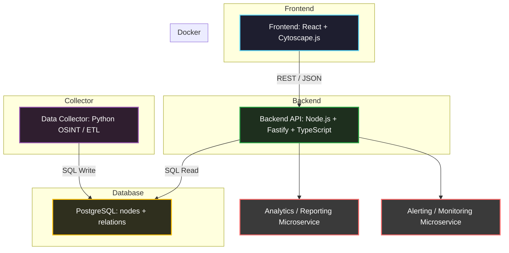

# Architecture & Roadmap

## 1. Architecture Diagram (Mermaid)

## 2. Docker & Services

Frontend – React + Cytoscape.js, desktop-first, graph visualization, filters, zoom

Backend API – Node.js + Fastify + TypeScript, /tree and /graph endpoints, SQL queries

PostgreSQL – nodes + relations, indexes, historical data, scalable for large graphs

Data Collector – Python OSINT / ETL, scraping BIP, PDF parsing, data normalization

Docker Compose – container orchestration, environment isolation, scalable deployments

Optional future microservices – analytics, alerts, graph exports

## 3. Project Roadmap - state-graph

### Phase 1: MVP
- [ ] Define data model (nodes + relations)
- [ ] Setup PostgreSQL in Docker
- [ ] Backend API with `/tree` and `/graph` endpoints
- [ ] Frontend with static Cytoscape graph visualization
- [ ] Data Collector: scrape initial city data
- [ ] Initial architecture diagram

### Phase 2: Extensions
- [ ] Add historical data (terms, institutional changes)
- [ ] Support PDF documents / asset declarations
- [ ] Interactive frontend filters (institution type, level, independence)
- [ ] Integration tests and CI/CD in Docker
- [ ] Automated updates from government sources

### Phase 3: Scaling & Analytics
- [ ] Multi-city / multi-voivodeship support
- [ ] Graph export / JSON API
- [ ] OSINT analytics and statistics
- [ ] Alerts for changes in structures or terms
