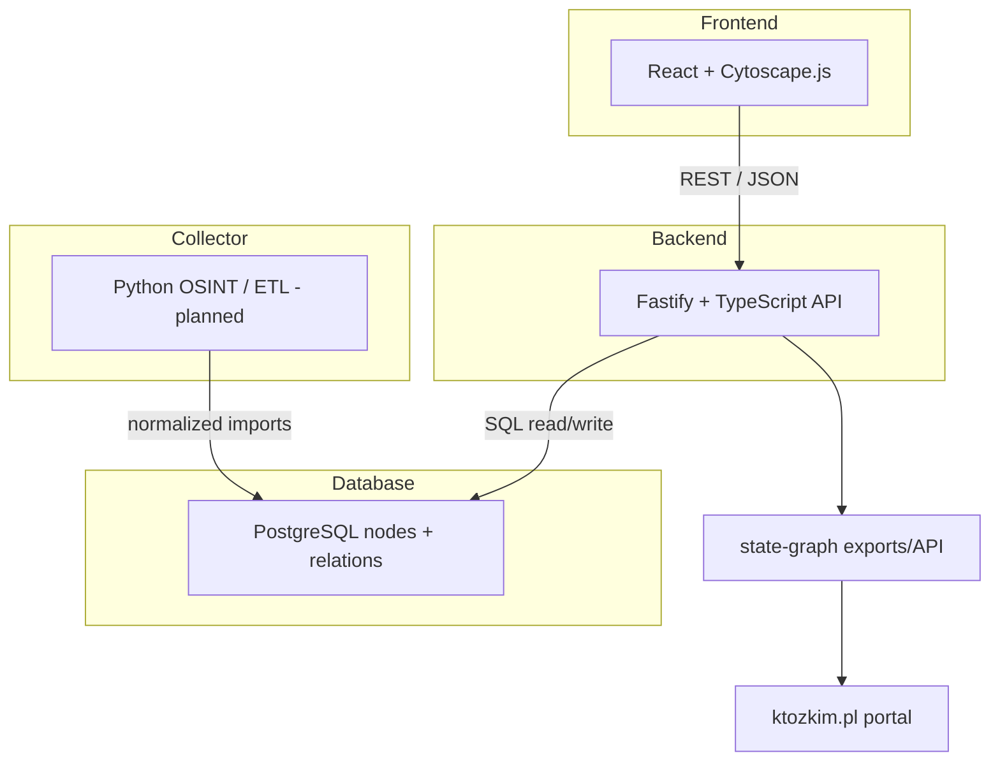

# Architektura state-graph

## Cel

`state-graph` models institutions, officials and formal relationships as graph data. It is data infrastructure, not the user-facing portal.

## High-level architecture

## Modules

| Module | Technology | Responsibility |
|---|---|---|
| `backend/` | Node.js + Fastify + TypeScript | Graph/tree/node/relation API |
| `frontend/` | React + Vite + Cytoscape.js | Graph visualization and exploration |
| `database/` | PostgreSQL SQL files | Schema, seed data, model docs |
| `collector/` | Python — planned | Scraping/ETL/normalization of real data |
| `docs/` | Markdown | Current architecture/status/decisions |

## Core model

- Nodes represent institutions, officials, public bodies or related entities.
- Relations represent formal links such as hierarchy, supervision, membership, appointment and independence.
- Historical/time-aware data is a future extension.

## Integration with `ktozkim.pl`

Recommended integration options, in increasing coupling:

1. API: `ktozkim` reads selected graph endpoints.
2. Snapshot export: `state-graph` exports JSON/CSV/SQL; `ktozkim` imports a snapshot.
3. Shared database: not recommended until the contract is stable.

Start with API or snapshot export.

## Data collector assumptions

Future collector should:

- identify sources explicitly
- keep raw source references/provenance
- apply rate limits and caching
- normalize into the graph schema
- avoid writing unverified claims as facts

## Risks

- Scraping without provenance or rate limiting.
- Coupling too tightly to `ktozkim` before data model stabilizes.
- Treating generic seed data as verified real-world data.
- Building analytics before import/data-quality foundations are reliable.
